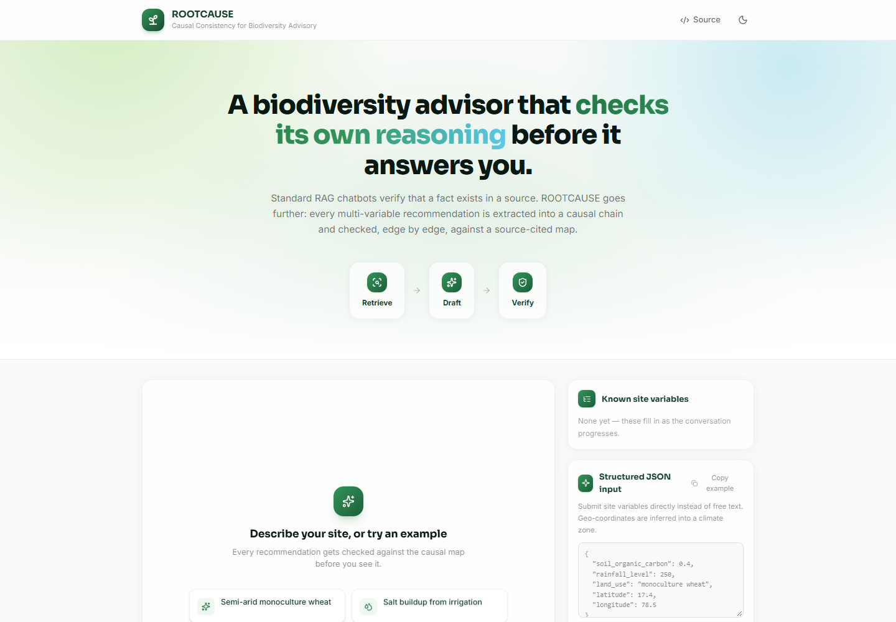
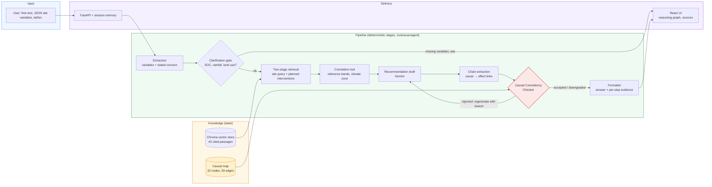

# ROOTCAUSE — Causal Consistency Checking for Environmental Advice

*An environmental advisory assistant that verifies each cause-and-effect step of its own recommendation against a citation-backed causal map before showing it to you.*

[](https://github.com/Rayyan-mohammed/eco-causal/actions/workflows/ci.yml)
[](LICENSE)


**Live demo: https://eco-causal.onrender.com/** (Render free tier; sleeps when idle, first load can take 30-60 s)

ROOTCAUSE answers questions like *"biodiversity is declining on my wheat farm, soil carbon is 0.3%, rainfall is low"* with a specific recommendation, the mechanism behind it, the metrics it should improve, a time horizon and sources. Standard retrieval-augmented generation checks that individual facts exist in a source; it does not check that the *chain of reasoning* joining those facts is valid. ROOTCAUSE adds a **Causal Consistency Checker** that extracts the drafted cause → effect chain and tests every link against an expert-curated graph (does the edge exist, is the direction right, does the user's own site data satisfy its condition). **On 30 scenarios, causal validity rose from ~12% (LLM only) to ~41% (retrieval) to ~75% (retrieval + checker), averaged over four live runs.**

> **Status: working end to end and deployed.** 55 tests pass, the checker agrees with a hand-labelled answer key on 64/64 claims (offline), and the three-condition live comparison has been run four times on 2026-09-18. It is a research-style prototype: the causal map covers 32 variables and 59 relationships, not the whole of ecology. See [Honest limitations](#honest-limitations).



---

## Architecture



The generator never sees the causal map: retrieval feeds the model, the map feeds only the checker. That keeps the checker independent of what it is judging, and keeps the "retrieval only" baseline in the evaluation honest, since the sole difference between it and the full system is the checker.

---

## The problem

A language model that has retrieved two true statements can still join them into a false recommendation, for example recommending an intervention that only works above a rainfall threshold to a semi-arid farm. In this project's own 30-scenario benchmark, a plain LLM produced a fully valid causal chain in **about 1 scenario in 10** (6.7%, 10.0%, 13.3%, 16.7% across four runs), and adding retrieval alone lifted that to only about 4 in 10 (36.7-43.3%). Fact-level retrieval checks do not catch this class of error, because each individual fact is true.

---

## How it works

| Layer | What it does |
|---|---|
| Extraction (`extraction.py`) | Turns free text into typed site variables and the user's stated concern using a Pydantic schema; also turns a draft's mechanism into `(cause, effect)` links mapped to causal-map node ids. |
| Clarification gate (`clarification.py`) | If soil organic carbon, rainfall level or land use is missing, asks one targeted follow-up instead of guessing; memory keeps answers across turns. |
| Two-stage retrieval (`retrieval.py`) | Queries Chroma with a site-aware query, then asks the model for 2-3 candidate interventions (planned against the knowledge-base topic list) and retrieves for each; merges, de-duplicates and returns a trace of what was asked and found. |
| Correlation tool (`tools.py`) | Converts numbers to literature-derived bands (e.g. SOC 0.3% → "critically low", 450 mm → "semi-arid") and latitude to a climate zone. |
| Recommendation draft (`recommendation.py`) | Produces action, mechanism, impacted metrics, a numeric time horizon and an expected effect that may only quote figures present in the retrieved excerpts. |
| Causal Consistency Checker (`checker.py`) | For each link: edge exists? direction matches? attached `condition_check` satisfied by the user's variables? Verdict is accepted, downgraded (edge real but condition unverifiable) or rejected. |
| Regeneration loop (`pipeline.py`) | A rejected draft is regenerated with the failing step named; default 1 retry when deployed, 3 in the evaluation (`ROOTCAUSE_MAX_REGENERATIONS`). |
| Formatter (`formatter.py`) | Returns separate fields: action, mechanism, impacted metrics, time horizon (short / medium / long derived from the numeric range), expected effect, confidence, verdict and per-step evidence with citations. |
| API + UI (`app/api.py`, `frontend/`) | FastAPI with in-memory sessions; React Flow draws the exact chain the checker evaluated, coloured green / amber / red. |

---

## Results

All live numbers use `gemini-3.1-flash-lite` on the free tier. LLM output is non-deterministic, so every run is reported rather than the best one. The same checker scores all three conditions.

### 1. The checker matches a hand-labelled answer key

| Measure (30 scenarios, 64 claims, offline, deterministic) | Result |
|---|---|
| Exact match with answer key | 64 / 64 (100%) |
| Precision (flagged invalid → truly invalid) | 100% |
| Recall (truly invalid → flagged) | 100% |

> **Honest scope:** the answer key was written by the author against the same causal map, so this is a regression test of the checker's logic, not independent validation of the map's scientific completeness.

### 2. The checker, not just retrieval, is what lifts causal validity

Share of the 30 scenarios whose whole causal chain passed (`eval/run_eval.py --live` then `--score`), 2026-09-18:

| Condition | Run A | Run B | Run C | Run D | Average |
|---|---|---|---|---|---|
| LLM only (no retrieval, no checker) | 6.7% | 10.0% | 13.3% | 16.7% | ~11.7% |
| RAG grounded (retrieval, no checker) | 40.0% | 43.3% | 43.3% | 36.7% | ~40.8% |
| **ROOTCAUSE (retrieval + checker)** | 80.0% | 70.0% | 73.3% | 76.7% | **~75.0%** |

Run D (the current pipeline, with two-stage retrieval) in full: LLM only 5 accepted / 2 downgraded / 23 rejected; RAG 11 / 2 / 17; ROOTCAUSE 23 / 5 / 2. In Run D, 4 of 30 scenarios initially failed with Gemini 504 timeouts and were re-run from the checkpoint.

> **Honest scope:** Runs A-C predate the two-stage retrieval and numeric-horizon change; Run D is the current pipeline. Run D's RAG-only score (36.7%) is the lowest of the four, so two-stage retrieval did not measurably help the retrieval-only baseline; the full system's 76.7% is within the run-to-run spread of A-C. Longer LLM-only answers also yield longer chains, which mechanically raises their chance of one unsupported step, so part of the LLM-only gap is length, not only hallucination. The map is incomplete, which lowers all three conditions equally.

### 3. A worked example from the challenge brief

Input: soil organic carbon 0.3%, low rainfall, monoculture wheat, semi-arid. Real output from the current pipeline:

| Field | Value |
|---|---|
| Recommendation | Implement agroforestry (windbreaks or alley cropping) within the wheat fields |
| Mechanism | Agroforestry increases soil organic carbon and soil moisture retention; higher soil organic carbon supports microbial diversity; structural complexity and flowering resources support pollinator abundance |
| Metrics improved | Soil organic carbon, soil microbial diversity, pollinator abundance |
| Time horizon | 3-5 years (medium) |
| Checker verdict | Accepted, high confidence; all conditions satisfied by the site data |
| Expected effect | "Not quantified in the retrieved evidence." |

> **Note:** the last row is deliberate. The system quotes a figure only when a retrieved source states one, and in this run the selected passages did not, so it says so instead of inventing a percentage. A passage with a quantified agroforestry carbon result (Shi et al. 2018) is in the knowledge base; the model did not use it on this run.

### 4. Retrieval finds interventions, not just problems

A goal-only query ("biodiversity is declining") returned passages about the problem. A goal plus site query did not retrieve the agroforestry passage in a test, so retrieval now proposes candidate interventions first and queries for each. `tests/test_vectorstore.py::test_gather_evidence_merges_intervention_queries_and_survives_planner_failure` asserts the agroforestry evidence is retrieved, that merged results are de-duplicated, and that a failed planning call degrades to the base query rather than failing the turn.

---

## Honest limitations

- **The causal map is expert-curated, not discovered.** 32 nodes and 59 edges (39 high, 19 medium, 1 low confidence). A real relationship absent from the map is rejected, so absolute validity rates understate reality; only the ordering between conditions is solid evidence.
- **Only 11 of 59 edges carry a machine-checkable condition** (rainfall thresholds, a soil pH threshold for earthworms, categorical grazing severity). Other documented conditions (fertiliser rate, drainage, deforestation scale) are cited but unchecked, so those claims are downgraded rather than verified.
- **The checker inspects the mechanism text, not the whole answer.** Wording in the `action` field is not checked, which is why the prompt confines it to *what* to do.
- **Quantified effects are sparse.** The knowledge base has 43 passages; only some contain measured figures, so many answers say "Not quantified" instead of giving an estimate.
- **Evaluation is small and self-scored.** 30 scenarios, one author, one model, the same checker generating and scoring the comparison. Not a substitute for expert review.
- **Deployed defaults trade quality for reliability.** The hosted app retries a rejected draft once (evaluation: three) to stay within request timeouts.
- **Free-tier constraints.** Gemini rate limits and 503s occur; the client rotates across keys, but responses can be slow. Render's free tier sleeps when idle. Sessions are in memory and lost on restart.
- **Slow on the free host.** A full advisory turn took **124.9 s and 124.0 s** on the deployed Render free instance (2 timed turns, 2026-09-18, challenge example input), against **38.6 s** for the same input run locally (4 Gemini calls, the first taking 20.1 s). The clarification-only turn took 7.8 s. The hosted UI therefore shows a long wait before a recommendation appears; [TODO: profile where the extra ~85 s goes on Render's shared CPU].

---

## Repository structure

```
.github/workflows/ci.yml   CI: backend tests + offline eval, frontend lint + build, docker build
app/api.py                 FastAPI: /api/session, /chat, /variables, /reset, /status; serves frontend/dist
data/
  causal_map.json          32 nodes, 59 edges with mechanism, condition, confidence, citation
  reference_ranges.json    literature-derived bands (SOC, rainfall, pH, salinity)
  knowledge/*.md           cited passages for the five domains (indexed into 43 chunks)
  sources.md               primary-source list and citation verification notes
rootcause/
  agent/                   extraction, clarification, retrieval, recommendation, checker, pipeline, state
  causal/graph.py          causal map loader (exists / direction / condition queries)
  knowledge/vectorstore.py Chroma index over data/knowledge
  output/formatter.py      structured response assembly
  llm.py                   Gemini client with multi-key rotation and structured output
frontend/                  React 19 + Vite + Tailwind v4 + React Flow + framer-motion UI
eval/
  test_scenarios.json      30 scenarios, 64 hand-labelled claims
  run_eval.py              offline check, --live 3-condition comparison (checkpointed), --score
tests/                     55 pytest tests (graph, checker, clarification, tools, retrieval, API, LLM rotation)
Dockerfile                 multi-stage: Node builds the UI, Python serves API + UI
LICENSE                    MIT
ROOTCAUSE_Blueprint.docx   original research write-up this implementation follows
```

---

## Quick start

No API key and no cloud account needed to verify the core result:

```bash
git clone https://github.com/Rayyan-mohammed/eco-causal.git
cd eco-causal
python -m venv .venv && source .venv/bin/activate   # Windows: .venv\Scripts\activate
pip install -r requirements.txt
python eval/run_eval.py      # checker vs 64 labelled claims: expect 100% exact match
pytest tests/ -q             # expect 55 passed (API tests adapt if the UI is not built)
```

To chat with it locally you need a free key from [aistudio.google.com/apikey](https://aistudio.google.com/apikey) (Google account, no card):

```bash
cp .env.example .env         # set GEMINI_API_KEY
cd frontend && npm install && npm run build && cd ..
uvicorn app.api:app --port 8000     # open http://127.0.0.1:8000
```

---

## Reproduce everything else

```bash
# frontend with hot reload (two terminals)
uvicorn app.api:app --reload --port 8000
cd frontend && npm run dev

# more throughput: several free-tier keys, numbered without gaps, in .env
# GEMINI_API_KEY_1=...   GEMINI_API_KEY_2=...

# the full live three-condition evaluation (checkpoints after every scenario;
# rerun the same command to resume after an interruption, --fresh to restart)
python eval/run_eval.py --live
python eval/run_eval.py --score          # applies the same checker to all three conditions

# frontend checks, as CI runs them
cd frontend && npm ci && npm run lint && npm run build

# container, as CI builds it
docker build -t rootcause .
docker run -p 8000:8000 -e PORT=8000 -e GEMINI_API_KEY=... rootcause

# hosting: any Docker host (Render, Fly.io, Railway) builds the Dockerfile as-is;
# set GEMINI_API_KEY (or numbered keys) as environment variables
```

### Operational notes

| Concern | Guidance |
|---|---|
| Secrets | Keys live only in a gitignored `.env` or the host's environment variables; never commit them. |
| Cost | Gemini free tier and Render free tier, so no billing is attached. Rotate or delete keys in Google AI Studio if exposed. |
| Rebuilding the index | Stop the server and any running eval first: rebuilding Chroma while another process holds it produced stale-collection errors during development. Rebuild with `KnowledgeStore().build_index(rebuild=True)`. |
| Regeneration depth | `ROOTCAUSE_MAX_REGENERATIONS` (default 1). Higher is more accurate and slower; the eval sets 3. |

---

## Roadmap

Built over 2026-09-17 to 2026-09-18.

| Workstream | Core pipeline | Evidence and eval | Product | Deployment |
|---|---|---|---|---|
| Done | ✅ Extraction, clarification, retrieval, draft, checker, regeneration | ✅ 30 scenarios / 64 claims, offline eval, three live runs, checkpoint and resume | ✅ React UI with reasoning graph, per-step evidence, structured JSON input | ✅ Docker, GitHub Actions CI, Render deployment |
| Next | Two-stage retrieval tuning | More scenarios and a second annotator | Screenshots, latency measurement | Persistent sessions |
| Later | Wire structured conditions to the remaining edges | Independent expert review of the map | Geo-spatial input from real datasets (SoilGrids, ESA WorldCover) | Automatic index refresh |

---

## Authors

- **Rayyan Mohammed** ([@Rayyan-mohammed](https://github.com/Rayyan-mohammed)): design and ownership of the whole project: causal map and citation curation, pipeline and checker, evaluation, React frontend, and deployment. Built with AI coding assistance under their direction.

---

## Documentation index

- [`ROOTCAUSE_Blueprint.docx`](ROOTCAUSE_Blueprint.docx): original research design and evaluation plan
- [`data/sources.md`](data/sources.md): source portals, citation verification
- [`data/causal_map.json`](data/causal_map.json): every edge with mechanism and citation
- [`eval/test_scenarios.json`](eval/test_scenarios.json): scenarios and answer key
- [`.github/workflows/ci.yml`](.github/workflows/ci.yml): the CI pipeline definition
- [`frontend/README.md`](frontend/README.md): frontend build notes
- [`Dockerfile`](Dockerfile): multi-stage production build
- [`LICENSE`](LICENSE): MIT

---

## References

- Zecevic, Willig, Dhami & Kersting (2023). *Causal Parrots: Large Language Models May Talk Causality But Are Not Causal.* arXiv:2308.13067.
- Wu et al. (2025). *Why LLMs Fail at Causal Discovery and How Interventional Agents Escape.* arXiv:2605.27567.
